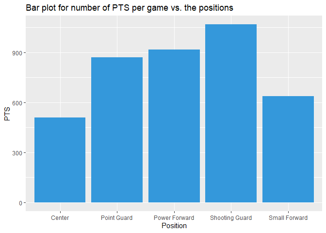

<!-- README.md is generated from README.Rmd. Please edit that file -->

# myNBApkg

<!-- badges: start -->
<!-- badges: end -->

The goal of myNBApkg is to

## Overview

This package was designed as part of a final project for Biostatistical
Computing with the goal of assisting in performing computations of
summary statistics, illustrations, and models to better understand NBA
seasonal data.

## Installation

You can install the development version of myNBApkg from
[GitHub](https://github.com/RamiHawila/myNBApkg) with:

``` r
# install.packages("devtools")
devtools::install_github("RamiHawila/myNBApkg")
```

## Load the package

``` r
library(myNBApkg)
```

## Example

This is a basic example which will illustrate the usage of the different
available functions.

### Player-level exploration

We will use the functions below to describe the performance of Stephen
Curry based on the 2022-2023 NBA season. The first table demonstrates a
number of Stephen’s statistics. The true shooting percentage, free throw
rate, assists, and turnover rates are also demonstrated using the
functions.

``` r
player_basic_stats(player="Stephen Curry", data=DATASET)
#>          Player    Position Team Field Goals Total Rebounds Assists Steals
#> 1 Stephen Curry Point Guard  GSW        10.7            6.8     7.1    1.2
#>   Blocks Turnovers Personal Fouls
#> 1    0.2       2.9              2
true_shooting_percentage(player="Stephen Curry", data=DATASET)
#> The true shooting percentage for Stephen Curry is 68.8%
free_throw_rate(player="Stephen Curry", data=DATASET)
#> The free throw rate for Stephen Curry is 25.9%
basic_stats_rate(player="Stephen Curry", data=DATASET)
#> The assists and turnover rates of Stephen Curry are 34.1% and 11.3% respectively.
```

### Position-level exploration

We will use the functions below to describe the characteristics of the
Point Guard position based on the 2022-2023 NBA season. The first table
demonstrates a number of the statistics associated with point guards
including field goals, rebounds, assists, etc. In the second table, the
top 5 point guards in terms of scoring points are shown. A barplot is
presented comparing the Points scored for different positions.

``` r
position_stats(position = "Point Guard", data = DATASET)
#>      Position Field Goals Total Rebounds  Assists Steals    Blocks Turnovers
#> 1 Point Guard    4.117105       3.036842 4.256579  0.925 0.3171053  1.714474
#>   Personal Fouls
#> 1       1.811842
position_best(position = "Point Guard", measure = "PTS", topn = 5,data = DATASET)
#>            Player  Tm    Position  PTS
#> 19    Luka Dončić DAL Point Guard 33.1
#> 15  Stephen Curry GSW Point Guard 31.4
#> 50      Ja Morant MEM Point Guard 28.5
#> 76     Trae Young ATL Point Guard 28.2
#> 40 Damian Lillard POR Point Guard 26.3
plot_basic_stats(measure="PTS",data=DATASET)
```



### Modelling of Free Throw Percentage and Minutes Played

We will use the function below to model the free throw success rate and
minutes played based on the 2022-2023 NBA season. This function produces
a table that summarizes the linear regression fit. Based on the results
from the first table, we can see that field goals have a significantly
negative impact on the free throw rates, where as effective field goals
percentage and point scored have a significantly positive impact on the
free throw rates. Based on the results from the second table, the
position played in addition to age, personal fouls, and points scored
had significant positive impact on the number of minutes played.

``` r
modelling(response = "FT.",data=DATASET)
```

<div id="xribygssrw" style="padding-left:0px;padding-right:0px;padding-top:10px;padding-bottom:10px;overflow-x:auto;overflow-y:auto;width:auto;height:auto;">
<style>html {
  font-family: -apple-system, BlinkMacSystemFont, 'Segoe UI', Roboto, Oxygen, Ubuntu, Cantarell, 'Helvetica Neue', 'Fira Sans', 'Droid Sans', Arial, sans-serif;
}

#xribygssrw .gt_table {
  display: table;
  border-collapse: collapse;
  margin-left: auto;
  margin-right: auto;
  color: #333333;
  font-size: 16px;
  font-weight: normal;
  font-style: normal;
  background-color: #FFFFFF;
  width: auto;
  border-top-style: solid;
  border-top-width: 2px;
  border-top-color: #A8A8A8;
  border-right-style: none;
  border-right-width: 2px;
  border-right-color: #D3D3D3;
  border-bottom-style: solid;
  border-bottom-width: 2px;
  border-bottom-color: #A8A8A8;
  border-left-style: none;
  border-left-width: 2px;
  border-left-color: #D3D3D3;
}

#xribygssrw .gt_heading {
  background-color: #FFFFFF;
  text-align: center;
  border-bottom-color: #FFFFFF;
  border-left-style: none;
  border-left-width: 1px;
  border-left-color: #D3D3D3;
  border-right-style: none;
  border-right-width: 1px;
  border-right-color: #D3D3D3;
}

#xribygssrw .gt_caption {
  padding-top: 4px;
  padding-bottom: 4px;
}

#xribygssrw .gt_title {
  color: #333333;
  font-size: 125%;
  font-weight: initial;
  padding-top: 4px;
  padding-bottom: 4px;
  padding-left: 5px;
  padding-right: 5px;
  border-bottom-color: #FFFFFF;
  border-bottom-width: 0;
}

#xribygssrw .gt_subtitle {
  color: #333333;
  font-size: 85%;
  font-weight: initial;
  padding-top: 0;
  padding-bottom: 6px;
  padding-left: 5px;
  padding-right: 5px;
  border-top-color: #FFFFFF;
  border-top-width: 0;
}

#xribygssrw .gt_bottom_border {
  border-bottom-style: solid;
  border-bottom-width: 2px;
  border-bottom-color: #D3D3D3;
}

#xribygssrw .gt_col_headings {
  border-top-style: solid;
  border-top-width: 2px;
  border-top-color: #D3D3D3;
  border-bottom-style: solid;
  border-bottom-width: 2px;
  border-bottom-color: #D3D3D3;
  border-left-style: none;
  border-left-width: 1px;
  border-left-color: #D3D3D3;
  border-right-style: none;
  border-right-width: 1px;
  border-right-color: #D3D3D3;
}

#xribygssrw .gt_col_heading {
  color: #333333;
  background-color: #FFFFFF;
  font-size: 100%;
  font-weight: normal;
  text-transform: inherit;
  border-left-style: none;
  border-left-width: 1px;
  border-left-color: #D3D3D3;
  border-right-style: none;
  border-right-width: 1px;
  border-right-color: #D3D3D3;
  vertical-align: bottom;
  padding-top: 5px;
  padding-bottom: 6px;
  padding-left: 5px;
  padding-right: 5px;
  overflow-x: hidden;
}

#xribygssrw .gt_column_spanner_outer {
  color: #333333;
  background-color: #FFFFFF;
  font-size: 100%;
  font-weight: normal;
  text-transform: inherit;
  padding-top: 0;
  padding-bottom: 0;
  padding-left: 4px;
  padding-right: 4px;
}

#xribygssrw .gt_column_spanner_outer:first-child {
  padding-left: 0;
}

#xribygssrw .gt_column_spanner_outer:last-child {
  padding-right: 0;
}

#xribygssrw .gt_column_spanner {
  border-bottom-style: solid;
  border-bottom-width: 2px;
  border-bottom-color: #D3D3D3;
  vertical-align: bottom;
  padding-top: 5px;
  padding-bottom: 5px;
  overflow-x: hidden;
  display: inline-block;
  width: 100%;
}

#xribygssrw .gt_group_heading {
  padding-top: 8px;
  padding-bottom: 8px;
  padding-left: 5px;
  padding-right: 5px;
  color: #333333;
  background-color: #FFFFFF;
  font-size: 100%;
  font-weight: initial;
  text-transform: inherit;
  border-top-style: solid;
  border-top-width: 2px;
  border-top-color: #D3D3D3;
  border-bottom-style: solid;
  border-bottom-width: 2px;
  border-bottom-color: #D3D3D3;
  border-left-style: none;
  border-left-width: 1px;
  border-left-color: #D3D3D3;
  border-right-style: none;
  border-right-width: 1px;
  border-right-color: #D3D3D3;
  vertical-align: middle;
  text-align: left;
}

#xribygssrw .gt_empty_group_heading {
  padding: 0.5px;
  color: #333333;
  background-color: #FFFFFF;
  font-size: 100%;
  font-weight: initial;
  border-top-style: solid;
  border-top-width: 2px;
  border-top-color: #D3D3D3;
  border-bottom-style: solid;
  border-bottom-width: 2px;
  border-bottom-color: #D3D3D3;
  vertical-align: middle;
}

#xribygssrw .gt_from_md > :first-child {
  margin-top: 0;
}

#xribygssrw .gt_from_md > :last-child {
  margin-bottom: 0;
}

#xribygssrw .gt_row {
  padding-top: 8px;
  padding-bottom: 8px;
  padding-left: 5px;
  padding-right: 5px;
  margin: 10px;
  border-top-style: solid;
  border-top-width: 1px;
  border-top-color: #D3D3D3;
  border-left-style: none;
  border-left-width: 1px;
  border-left-color: #D3D3D3;
  border-right-style: none;
  border-right-width: 1px;
  border-right-color: #D3D3D3;
  vertical-align: middle;
  overflow-x: hidden;
}

#xribygssrw .gt_stub {
  color: #333333;
  background-color: #FFFFFF;
  font-size: 100%;
  font-weight: initial;
  text-transform: inherit;
  border-right-style: solid;
  border-right-width: 2px;
  border-right-color: #D3D3D3;
  padding-left: 5px;
  padding-right: 5px;
}

#xribygssrw .gt_stub_row_group {
  color: #333333;
  background-color: #FFFFFF;
  font-size: 100%;
  font-weight: initial;
  text-transform: inherit;
  border-right-style: solid;
  border-right-width: 2px;
  border-right-color: #D3D3D3;
  padding-left: 5px;
  padding-right: 5px;
  vertical-align: top;
}

#xribygssrw .gt_row_group_first td {
  border-top-width: 2px;
}

#xribygssrw .gt_summary_row {
  color: #333333;
  background-color: #FFFFFF;
  text-transform: inherit;
  padding-top: 8px;
  padding-bottom: 8px;
  padding-left: 5px;
  padding-right: 5px;
}

#xribygssrw .gt_first_summary_row {
  border-top-style: solid;
  border-top-color: #D3D3D3;
}

#xribygssrw .gt_first_summary_row.thick {
  border-top-width: 2px;
}

#xribygssrw .gt_last_summary_row {
  padding-top: 8px;
  padding-bottom: 8px;
  padding-left: 5px;
  padding-right: 5px;
  border-bottom-style: solid;
  border-bottom-width: 2px;
  border-bottom-color: #D3D3D3;
}

#xribygssrw .gt_grand_summary_row {
  color: #333333;
  background-color: #FFFFFF;
  text-transform: inherit;
  padding-top: 8px;
  padding-bottom: 8px;
  padding-left: 5px;
  padding-right: 5px;
}

#xribygssrw .gt_first_grand_summary_row {
  padding-top: 8px;
  padding-bottom: 8px;
  padding-left: 5px;
  padding-right: 5px;
  border-top-style: double;
  border-top-width: 6px;
  border-top-color: #D3D3D3;
}

#xribygssrw .gt_striped {
  background-color: rgba(128, 128, 128, 0.05);
}

#xribygssrw .gt_table_body {
  border-top-style: solid;
  border-top-width: 2px;
  border-top-color: #D3D3D3;
  border-bottom-style: solid;
  border-bottom-width: 2px;
  border-bottom-color: #D3D3D3;
}

#xribygssrw .gt_footnotes {
  color: #333333;
  background-color: #FFFFFF;
  border-bottom-style: none;
  border-bottom-width: 2px;
  border-bottom-color: #D3D3D3;
  border-left-style: none;
  border-left-width: 2px;
  border-left-color: #D3D3D3;
  border-right-style: none;
  border-right-width: 2px;
  border-right-color: #D3D3D3;
}

#xribygssrw .gt_footnote {
  margin: 0px;
  font-size: 90%;
  padding-left: 4px;
  padding-right: 4px;
  padding-left: 5px;
  padding-right: 5px;
}

#xribygssrw .gt_sourcenotes {
  color: #333333;
  background-color: #FFFFFF;
  border-bottom-style: none;
  border-bottom-width: 2px;
  border-bottom-color: #D3D3D3;
  border-left-style: none;
  border-left-width: 2px;
  border-left-color: #D3D3D3;
  border-right-style: none;
  border-right-width: 2px;
  border-right-color: #D3D3D3;
}

#xribygssrw .gt_sourcenote {
  font-size: 90%;
  padding-top: 4px;
  padding-bottom: 4px;
  padding-left: 5px;
  padding-right: 5px;
}

#xribygssrw .gt_left {
  text-align: left;
}

#xribygssrw .gt_center {
  text-align: center;
}

#xribygssrw .gt_right {
  text-align: right;
  font-variant-numeric: tabular-nums;
}

#xribygssrw .gt_font_normal {
  font-weight: normal;
}

#xribygssrw .gt_font_bold {
  font-weight: bold;
}

#xribygssrw .gt_font_italic {
  font-style: italic;
}

#xribygssrw .gt_super {
  font-size: 65%;
}

#xribygssrw .gt_footnote_marks {
  font-style: italic;
  font-weight: normal;
  font-size: 75%;
  vertical-align: 0.4em;
}

#xribygssrw .gt_asterisk {
  font-size: 100%;
  vertical-align: 0;
}

#xribygssrw .gt_indent_1 {
  text-indent: 5px;
}

#xribygssrw .gt_indent_2 {
  text-indent: 10px;
}

#xribygssrw .gt_indent_3 {
  text-indent: 15px;
}

#xribygssrw .gt_indent_4 {
  text-indent: 20px;
}

#xribygssrw .gt_indent_5 {
  text-indent: 25px;
}
</style>
<table class="gt_table">
  <thead class="gt_header">
    <tr>
      <td colspan="4" class="gt_heading gt_title gt_font_normal gt_bottom_border" style>Linear regression summary modelling Free Throw Percentage per game</td>
    </tr>
    
  </thead>
  <thead class="gt_col_headings">
    <tr>
      <th class="gt_col_heading gt_columns_bottom_border gt_left" rowspan="1" colspan="1" scope="col" id="&lt;strong&gt;Characteristic&lt;/strong&gt;"><strong>Characteristic</strong></th>
      <th class="gt_col_heading gt_columns_bottom_border gt_center" rowspan="1" colspan="1" scope="col" id="&lt;strong&gt;Beta&lt;/strong&gt;"><strong>Beta</strong></th>
      <th class="gt_col_heading gt_columns_bottom_border gt_center" rowspan="1" colspan="1" scope="col" id="&lt;strong&gt;95% CI&lt;/strong&gt;&lt;sup class=&quot;gt_footnote_marks&quot;&gt;1&lt;/sup&gt;"><strong>95% CI</strong><sup class="gt_footnote_marks">1</sup></th>
      <th class="gt_col_heading gt_columns_bottom_border gt_center" rowspan="1" colspan="1" scope="col" id="&lt;strong&gt;p-value&lt;/strong&gt;"><strong>p-value</strong></th>
    </tr>
  </thead>
  <tbody class="gt_table_body">
    <tr><td headers="label" class="gt_row gt_left" style="font-weight: bold;">Position</td>
<td headers="estimate" class="gt_row gt_center"></td>
<td headers="ci" class="gt_row gt_center"></td>
<td headers="p.value" class="gt_row gt_center"></td></tr>
    <tr><td headers="label" class="gt_row gt_left" style="font-style: italic;">    Center</td>
<td headers="estimate" class="gt_row gt_center">—</td>
<td headers="ci" class="gt_row gt_center">—</td>
<td headers="p.value" class="gt_row gt_center"></td></tr>
    <tr><td headers="label" class="gt_row gt_left" style="font-style: italic;">    Point Guard</td>
<td headers="estimate" class="gt_row gt_center">0.02</td>
<td headers="ci" class="gt_row gt_center">-0.03, 0.07</td>
<td headers="p.value" class="gt_row gt_center">0.4</td></tr>
    <tr><td headers="label" class="gt_row gt_left" style="font-style: italic;">    Power Forward</td>
<td headers="estimate" class="gt_row gt_center">0.01</td>
<td headers="ci" class="gt_row gt_center">-0.04, 0.06</td>
<td headers="p.value" class="gt_row gt_center">0.7</td></tr>
    <tr><td headers="label" class="gt_row gt_left" style="font-style: italic;">    Shooting Guard</td>
<td headers="estimate" class="gt_row gt_center">0.04</td>
<td headers="ci" class="gt_row gt_center">-0.01, 0.09</td>
<td headers="p.value" class="gt_row gt_center">0.10</td></tr>
    <tr><td headers="label" class="gt_row gt_left" style="font-style: italic;">    Small Forward</td>
<td headers="estimate" class="gt_row gt_center">0.04</td>
<td headers="ci" class="gt_row gt_center">-0.01, 0.09</td>
<td headers="p.value" class="gt_row gt_center">0.2</td></tr>
    <tr><td headers="label" class="gt_row gt_left" style="font-weight: bold;">FG</td>
<td headers="estimate" class="gt_row gt_center">-0.10</td>
<td headers="ci" class="gt_row gt_center">-0.14, -0.06</td>
<td headers="p.value" class="gt_row gt_center" style="font-weight: bold;"><0.001</td></tr>
    <tr><td headers="label" class="gt_row gt_left" style="font-weight: bold;">eFG.</td>
<td headers="estimate" class="gt_row gt_center">0.20</td>
<td headers="ci" class="gt_row gt_center">0.01, 0.38</td>
<td headers="p.value" class="gt_row gt_center" style="font-weight: bold;">0.036</td></tr>
    <tr><td headers="label" class="gt_row gt_left" style="font-weight: bold;">PTS</td>
<td headers="estimate" class="gt_row gt_center">0.04</td>
<td headers="ci" class="gt_row gt_center">0.03, 0.06</td>
<td headers="p.value" class="gt_row gt_center" style="font-weight: bold;"><0.001</td></tr>
  </tbody>
  
  <tfoot class="gt_footnotes">
    <tr>
      <td class="gt_footnote" colspan="4"><sup class="gt_footnote_marks">1</sup> CI = Confidence Interval</td>
    </tr>
  </tfoot>
</table>
</div>
modelling(response = "MP",data=DATASET)
<div id="oktcuifrwr" style="padding-left:0px;padding-right:0px;padding-top:10px;padding-bottom:10px;overflow-x:auto;overflow-y:auto;width:auto;height:auto;">
<style>html {
  font-family: -apple-system, BlinkMacSystemFont, 'Segoe UI', Roboto, Oxygen, Ubuntu, Cantarell, 'Helvetica Neue', 'Fira Sans', 'Droid Sans', Arial, sans-serif;
}

#oktcuifrwr .gt_table {
  display: table;
  border-collapse: collapse;
  margin-left: auto;
  margin-right: auto;
  color: #333333;
  font-size: 16px;
  font-weight: normal;
  font-style: normal;
  background-color: #FFFFFF;
  width: auto;
  border-top-style: solid;
  border-top-width: 2px;
  border-top-color: #A8A8A8;
  border-right-style: none;
  border-right-width: 2px;
  border-right-color: #D3D3D3;
  border-bottom-style: solid;
  border-bottom-width: 2px;
  border-bottom-color: #A8A8A8;
  border-left-style: none;
  border-left-width: 2px;
  border-left-color: #D3D3D3;
}

#oktcuifrwr .gt_heading {
  background-color: #FFFFFF;
  text-align: center;
  border-bottom-color: #FFFFFF;
  border-left-style: none;
  border-left-width: 1px;
  border-left-color: #D3D3D3;
  border-right-style: none;
  border-right-width: 1px;
  border-right-color: #D3D3D3;
}

#oktcuifrwr .gt_caption {
  padding-top: 4px;
  padding-bottom: 4px;
}

#oktcuifrwr .gt_title {
  color: #333333;
  font-size: 125%;
  font-weight: initial;
  padding-top: 4px;
  padding-bottom: 4px;
  padding-left: 5px;
  padding-right: 5px;
  border-bottom-color: #FFFFFF;
  border-bottom-width: 0;
}

#oktcuifrwr .gt_subtitle {
  color: #333333;
  font-size: 85%;
  font-weight: initial;
  padding-top: 0;
  padding-bottom: 6px;
  padding-left: 5px;
  padding-right: 5px;
  border-top-color: #FFFFFF;
  border-top-width: 0;
}

#oktcuifrwr .gt_bottom_border {
  border-bottom-style: solid;
  border-bottom-width: 2px;
  border-bottom-color: #D3D3D3;
}

#oktcuifrwr .gt_col_headings {
  border-top-style: solid;
  border-top-width: 2px;
  border-top-color: #D3D3D3;
  border-bottom-style: solid;
  border-bottom-width: 2px;
  border-bottom-color: #D3D3D3;
  border-left-style: none;
  border-left-width: 1px;
  border-left-color: #D3D3D3;
  border-right-style: none;
  border-right-width: 1px;
  border-right-color: #D3D3D3;
}

#oktcuifrwr .gt_col_heading {
  color: #333333;
  background-color: #FFFFFF;
  font-size: 100%;
  font-weight: normal;
  text-transform: inherit;
  border-left-style: none;
  border-left-width: 1px;
  border-left-color: #D3D3D3;
  border-right-style: none;
  border-right-width: 1px;
  border-right-color: #D3D3D3;
  vertical-align: bottom;
  padding-top: 5px;
  padding-bottom: 6px;
  padding-left: 5px;
  padding-right: 5px;
  overflow-x: hidden;
}

#oktcuifrwr .gt_column_spanner_outer {
  color: #333333;
  background-color: #FFFFFF;
  font-size: 100%;
  font-weight: normal;
  text-transform: inherit;
  padding-top: 0;
  padding-bottom: 0;
  padding-left: 4px;
  padding-right: 4px;
}

#oktcuifrwr .gt_column_spanner_outer:first-child {
  padding-left: 0;
}

#oktcuifrwr .gt_column_spanner_outer:last-child {
  padding-right: 0;
}

#oktcuifrwr .gt_column_spanner {
  border-bottom-style: solid;
  border-bottom-width: 2px;
  border-bottom-color: #D3D3D3;
  vertical-align: bottom;
  padding-top: 5px;
  padding-bottom: 5px;
  overflow-x: hidden;
  display: inline-block;
  width: 100%;
}

#oktcuifrwr .gt_group_heading {
  padding-top: 8px;
  padding-bottom: 8px;
  padding-left: 5px;
  padding-right: 5px;
  color: #333333;
  background-color: #FFFFFF;
  font-size: 100%;
  font-weight: initial;
  text-transform: inherit;
  border-top-style: solid;
  border-top-width: 2px;
  border-top-color: #D3D3D3;
  border-bottom-style: solid;
  border-bottom-width: 2px;
  border-bottom-color: #D3D3D3;
  border-left-style: none;
  border-left-width: 1px;
  border-left-color: #D3D3D3;
  border-right-style: none;
  border-right-width: 1px;
  border-right-color: #D3D3D3;
  vertical-align: middle;
  text-align: left;
}

#oktcuifrwr .gt_empty_group_heading {
  padding: 0.5px;
  color: #333333;
  background-color: #FFFFFF;
  font-size: 100%;
  font-weight: initial;
  border-top-style: solid;
  border-top-width: 2px;
  border-top-color: #D3D3D3;
  border-bottom-style: solid;
  border-bottom-width: 2px;
  border-bottom-color: #D3D3D3;
  vertical-align: middle;
}

#oktcuifrwr .gt_from_md > :first-child {
  margin-top: 0;
}

#oktcuifrwr .gt_from_md > :last-child {
  margin-bottom: 0;
}

#oktcuifrwr .gt_row {
  padding-top: 8px;
  padding-bottom: 8px;
  padding-left: 5px;
  padding-right: 5px;
  margin: 10px;
  border-top-style: solid;
  border-top-width: 1px;
  border-top-color: #D3D3D3;
  border-left-style: none;
  border-left-width: 1px;
  border-left-color: #D3D3D3;
  border-right-style: none;
  border-right-width: 1px;
  border-right-color: #D3D3D3;
  vertical-align: middle;
  overflow-x: hidden;
}

#oktcuifrwr .gt_stub {
  color: #333333;
  background-color: #FFFFFF;
  font-size: 100%;
  font-weight: initial;
  text-transform: inherit;
  border-right-style: solid;
  border-right-width: 2px;
  border-right-color: #D3D3D3;
  padding-left: 5px;
  padding-right: 5px;
}

#oktcuifrwr .gt_stub_row_group {
  color: #333333;
  background-color: #FFFFFF;
  font-size: 100%;
  font-weight: initial;
  text-transform: inherit;
  border-right-style: solid;
  border-right-width: 2px;
  border-right-color: #D3D3D3;
  padding-left: 5px;
  padding-right: 5px;
  vertical-align: top;
}

#oktcuifrwr .gt_row_group_first td {
  border-top-width: 2px;
}

#oktcuifrwr .gt_summary_row {
  color: #333333;
  background-color: #FFFFFF;
  text-transform: inherit;
  padding-top: 8px;
  padding-bottom: 8px;
  padding-left: 5px;
  padding-right: 5px;
}

#oktcuifrwr .gt_first_summary_row {
  border-top-style: solid;
  border-top-color: #D3D3D3;
}

#oktcuifrwr .gt_first_summary_row.thick {
  border-top-width: 2px;
}

#oktcuifrwr .gt_last_summary_row {
  padding-top: 8px;
  padding-bottom: 8px;
  padding-left: 5px;
  padding-right: 5px;
  border-bottom-style: solid;
  border-bottom-width: 2px;
  border-bottom-color: #D3D3D3;
}

#oktcuifrwr .gt_grand_summary_row {
  color: #333333;
  background-color: #FFFFFF;
  text-transform: inherit;
  padding-top: 8px;
  padding-bottom: 8px;
  padding-left: 5px;
  padding-right: 5px;
}

#oktcuifrwr .gt_first_grand_summary_row {
  padding-top: 8px;
  padding-bottom: 8px;
  padding-left: 5px;
  padding-right: 5px;
  border-top-style: double;
  border-top-width: 6px;
  border-top-color: #D3D3D3;
}

#oktcuifrwr .gt_striped {
  background-color: rgba(128, 128, 128, 0.05);
}

#oktcuifrwr .gt_table_body {
  border-top-style: solid;
  border-top-width: 2px;
  border-top-color: #D3D3D3;
  border-bottom-style: solid;
  border-bottom-width: 2px;
  border-bottom-color: #D3D3D3;
}

#oktcuifrwr .gt_footnotes {
  color: #333333;
  background-color: #FFFFFF;
  border-bottom-style: none;
  border-bottom-width: 2px;
  border-bottom-color: #D3D3D3;
  border-left-style: none;
  border-left-width: 2px;
  border-left-color: #D3D3D3;
  border-right-style: none;
  border-right-width: 2px;
  border-right-color: #D3D3D3;
}

#oktcuifrwr .gt_footnote {
  margin: 0px;
  font-size: 90%;
  padding-left: 4px;
  padding-right: 4px;
  padding-left: 5px;
  padding-right: 5px;
}

#oktcuifrwr .gt_sourcenotes {
  color: #333333;
  background-color: #FFFFFF;
  border-bottom-style: none;
  border-bottom-width: 2px;
  border-bottom-color: #D3D3D3;
  border-left-style: none;
  border-left-width: 2px;
  border-left-color: #D3D3D3;
  border-right-style: none;
  border-right-width: 2px;
  border-right-color: #D3D3D3;
}

#oktcuifrwr .gt_sourcenote {
  font-size: 90%;
  padding-top: 4px;
  padding-bottom: 4px;
  padding-left: 5px;
  padding-right: 5px;
}

#oktcuifrwr .gt_left {
  text-align: left;
}

#oktcuifrwr .gt_center {
  text-align: center;
}

#oktcuifrwr .gt_right {
  text-align: right;
  font-variant-numeric: tabular-nums;
}

#oktcuifrwr .gt_font_normal {
  font-weight: normal;
}

#oktcuifrwr .gt_font_bold {
  font-weight: bold;
}

#oktcuifrwr .gt_font_italic {
  font-style: italic;
}

#oktcuifrwr .gt_super {
  font-size: 65%;
}

#oktcuifrwr .gt_footnote_marks {
  font-style: italic;
  font-weight: normal;
  font-size: 75%;
  vertical-align: 0.4em;
}

#oktcuifrwr .gt_asterisk {
  font-size: 100%;
  vertical-align: 0;
}

#oktcuifrwr .gt_indent_1 {
  text-indent: 5px;
}

#oktcuifrwr .gt_indent_2 {
  text-indent: 10px;
}

#oktcuifrwr .gt_indent_3 {
  text-indent: 15px;
}

#oktcuifrwr .gt_indent_4 {
  text-indent: 20px;
}

#oktcuifrwr .gt_indent_5 {
  text-indent: 25px;
}
</style>
<table class="gt_table">
  <thead class="gt_header">
    <tr>
      <td colspan="4" class="gt_heading gt_title gt_font_normal gt_bottom_border" style>Linear regression summary modelling Minutes Played per game</td>
    </tr>
    
  </thead>
  <thead class="gt_col_headings">
    <tr>
      <th class="gt_col_heading gt_columns_bottom_border gt_left" rowspan="1" colspan="1" scope="col" id="&lt;strong&gt;Characteristic&lt;/strong&gt;"><strong>Characteristic</strong></th>
      <th class="gt_col_heading gt_columns_bottom_border gt_center" rowspan="1" colspan="1" scope="col" id="&lt;strong&gt;Beta&lt;/strong&gt;"><strong>Beta</strong></th>
      <th class="gt_col_heading gt_columns_bottom_border gt_center" rowspan="1" colspan="1" scope="col" id="&lt;strong&gt;95% CI&lt;/strong&gt;&lt;sup class=&quot;gt_footnote_marks&quot;&gt;1&lt;/sup&gt;"><strong>95% CI</strong><sup class="gt_footnote_marks">1</sup></th>
      <th class="gt_col_heading gt_columns_bottom_border gt_center" rowspan="1" colspan="1" scope="col" id="&lt;strong&gt;p-value&lt;/strong&gt;"><strong>p-value</strong></th>
    </tr>
  </thead>
  <tbody class="gt_table_body">
    <tr><td headers="label" class="gt_row gt_left" style="font-weight: bold;">Position</td>
<td headers="estimate" class="gt_row gt_center"></td>
<td headers="ci" class="gt_row gt_center"></td>
<td headers="p.value" class="gt_row gt_center"></td></tr>
    <tr><td headers="label" class="gt_row gt_left" style="font-style: italic;">    Center</td>
<td headers="estimate" class="gt_row gt_center">—</td>
<td headers="ci" class="gt_row gt_center">—</td>
<td headers="p.value" class="gt_row gt_center"></td></tr>
    <tr><td headers="label" class="gt_row gt_left" style="font-style: italic;">    Point Guard</td>
<td headers="estimate" class="gt_row gt_center">6.0</td>
<td headers="ci" class="gt_row gt_center">4.3, 7.7</td>
<td headers="p.value" class="gt_row gt_center" style="font-weight: bold;"><0.001</td></tr>
    <tr><td headers="label" class="gt_row gt_left" style="font-style: italic;">    Power Forward</td>
<td headers="estimate" class="gt_row gt_center">3.2</td>
<td headers="ci" class="gt_row gt_center">1.8, 4.5</td>
<td headers="p.value" class="gt_row gt_center" style="font-weight: bold;"><0.001</td></tr>
    <tr><td headers="label" class="gt_row gt_left" style="font-style: italic;">    Shooting Guard</td>
<td headers="estimate" class="gt_row gt_center">5.3</td>
<td headers="ci" class="gt_row gt_center">3.7, 6.9</td>
<td headers="p.value" class="gt_row gt_center" style="font-weight: bold;"><0.001</td></tr>
    <tr><td headers="label" class="gt_row gt_left" style="font-style: italic;">    Small Forward</td>
<td headers="estimate" class="gt_row gt_center">5.4</td>
<td headers="ci" class="gt_row gt_center">3.8, 7.0</td>
<td headers="p.value" class="gt_row gt_center" style="font-weight: bold;"><0.001</td></tr>
    <tr><td headers="label" class="gt_row gt_left" style="font-weight: bold;">Age</td>
<td headers="estimate" class="gt_row gt_center">0.14</td>
<td headers="ci" class="gt_row gt_center">0.05, 0.23</td>
<td headers="p.value" class="gt_row gt_center" style="font-weight: bold;">0.002</td></tr>
    <tr><td headers="label" class="gt_row gt_left" style="font-weight: bold;">FG.</td>
<td headers="estimate" class="gt_row gt_center">-4.7</td>
<td headers="ci" class="gt_row gt_center">-9.8, 0.38</td>
<td headers="p.value" class="gt_row gt_center">0.070</td></tr>
    <tr><td headers="label" class="gt_row gt_left" style="font-weight: bold;">ORB</td>
<td headers="estimate" class="gt_row gt_center">0.75</td>
<td headers="ci" class="gt_row gt_center">-0.07, 1.6</td>
<td headers="p.value" class="gt_row gt_center">0.072</td></tr>
    <tr><td headers="label" class="gt_row gt_left" style="font-weight: bold;">DRB</td>
<td headers="estimate" class="gt_row gt_center">1.1</td>
<td headers="ci" class="gt_row gt_center">0.71, 1.5</td>
<td headers="p.value" class="gt_row gt_center" style="font-weight: bold;"><0.001</td></tr>
    <tr><td headers="label" class="gt_row gt_left" style="font-weight: bold;">PF</td>
<td headers="estimate" class="gt_row gt_center">2.9</td>
<td headers="ci" class="gt_row gt_center">2.3, 3.5</td>
<td headers="p.value" class="gt_row gt_center" style="font-weight: bold;"><0.001</td></tr>
    <tr><td headers="label" class="gt_row gt_left" style="font-weight: bold;">PTS</td>
<td headers="estimate" class="gt_row gt_center">0.72</td>
<td headers="ci" class="gt_row gt_center">0.64, 0.81</td>
<td headers="p.value" class="gt_row gt_center" style="font-weight: bold;"><0.001</td></tr>
  </tbody>
  
  <tfoot class="gt_footnotes">
    <tr>
      <td class="gt_footnote" colspan="4"><sup class="gt_footnote_marks">1</sup> CI = Confidence Interval</td>
    </tr>
  </tfoot>
</table>
</div>
